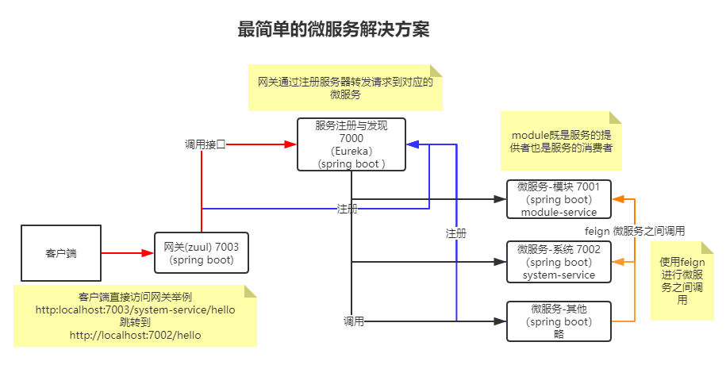

# dreamland-project

## 技术概要

- Spring Cloud：微服务架构集大成者，云计算最佳业务实践
  - Zuul：网关
  - Eureka：注册中心
- Spring Boot：整合Spring框架与优秀组件，开箱即用的后端框架
- lombok：简化代码，自动生成getter、setter的插件
- feign：用于微服务之间调用的客户端组件
- swagger2：接口测试和文档插件
- vue：一款MVVM模式的渐进式JavaScript框架
- element-ui：基于vue的UI库
- vue-element-admin：基于element-ui的后台管理系统UI

## 项目说明

1. [01-系统模块设计说明](dreamland-doc/01-系统模块设计说明.md)