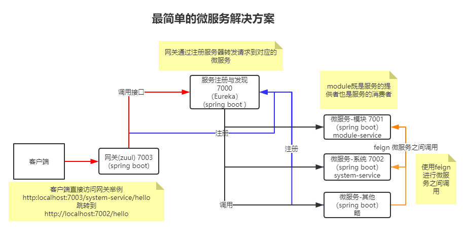

# dreamland-project

## 技术概要



- Spring Cloud：微服务架构集大成者，云计算最佳业务实践
  - Zuul：网关
  - Eureka：注册中心
- Spring Boot：整合Spring框架与优秀组件，开箱即用的后端框架
- lombok：简化代码，自动生成getter、setter的插件
- feign：用于微服务之间调用的客户端组件
- swagger2：接口测试和文档插件
- vue：一款MVVM模式的渐进式JavaScript框架
- element-ui：基于vue的UI库
- vue-element-admin：基于element-ui的后台管理系统UI

## 项目说明

### 部署说明

> 服务器要求（单机）

1. CPU >=8核心
2. 内存 >=32G
3. 硬盘 >=500G
4. 带宽 1M以上

> 所需软件和环境

开发/测试环境手动部署，生产环境持续集成+docker

| 推荐软件或者环境 | 版本要求  | 说明               |
| ---------------- | --------- | ------------------ |
| JDK              | 1.8.0_181 | Java环境           |
| nginx            | 1.16.1    | 静态站点，反向代理 |
| redis            | 5.0.5     | 内存数据库         |
| MySQL            | 8.0.17    | 数据库             |

> 安装

所有的服务都放在`/opt/module/api`，静态网站放在`/opt/module/statis`

nginx 只对外开放80端口

端口信息（域名未知）：

1. 7000	         服务注册与发现
2. 7001          网关
3. 7003          验证服务
4. 7005          商品与订单服务
5. /manager      管理中心
6. /apis         反向代理到7001 
7. /            官网首页

## 启动脚本

```bash
# dreamland-eureka-1.0.0.jar
nohup java -jar -Dloader.path=/opt/modules/service/lib /opt/modules/service/dreamland-eureka-1.0.0.jar --spring.profiles.active=prod > /dev/null 2> /dev/null &

# dreamland-gateway-1.0.0.jar
nohup java -jar -Dloader.path=/opt/modules/service/lib /opt/modules/service/dreamland-gateway-1.0.0.jar --spring.profiles.active=prod > /dev/null 2> /dev/null &

# dreamland-auth-api
nohup java -jar -Dloader.path=/opt/modules/service/lib /opt/modules/service/dreamland-auth-api-2.0.0.jar --spring.profiles.active=prod > /dev/null 2> /dev/null &

# dreamland-service-api
nohup java -jar -Dloader.path=/opt/modules/service/lib /opt/modules/service/dreamland-service-api-2.0.0.jar --spring.profiles.active=prod > /dev/null 2> /dev/null &

# dreamland-attachment-api
nohup java -jar -Dloader.path=/opt/modules/service/lib /opt/modules/service/dreamland-attachment-api-2.0.0.jar --spring.profiles.active=prod > /dev/null 2> /dev/null &
```
